## 2.1 Lesson Plan - Going Live

### Overview
Today's class is focused on empowering students with Heroku for live deployments and the concept of Git pull requests for better collaboration. 

##### Instructor Priorities:

* Students should be given a recap of what's been covered so far
* Students should learn how to incorporate CSS resets
* Students should learn to deploy their websites using Heroku
* Students should be exposed to the concept of pull requests in GitHub

##### Instructor Notes:

* Welcome back to Week 2! In this class, your primary focus as instructors/TAs is to ensure students are able to utilize Heroku to deploy their websites. Going forward from today, students will be expected to submit Homework with links to both their GitHub repository and a live deployed website on Heroku. For beginners, the process of deploying to Heroku is vastly mysterious and ripe with opportunities for simple, but critical bugs. Be ready to have your troubleshooting hat on.

* Critical for today's lesson is the [Heroku Guide](Supplemental/HerokuGuide) found in the Supplemental folder of this week's content. Ensure that students are actively using this guide in all their deployment efforts. The process we use to deploy to Heroku is a bit of a "hack" as Heroku isn't truly intended for static websites. In order to get around this, we inject a little PHP magic to make this work. If students attempt to "research" this solution for themselves, it will likely lead them to dark alleys. So for now, have them trust you that this approach works and the explanation of the "why" is less relevant. You can let them know that Heroku is just one of many ways to deploy a website. 

* Towards the end of this lesson plan, we've included a "Common Issues" section. This is intended to help you as an instructor/TA better assist your students by offering possible solutions to students' bugs.

* Lastly, the slideshow and lesson plan for today include an extra section on Git Pull Requests. Consider this section to be used only if you have spare time. If students are stuck on Heroku issues, focus on resolving these first and foremost. There will be time to discuss Git Pull requests at a later date in the program. 

* Have your TAs reference [2.1-TimeTracker](2.1-TimeTracker.xlsx) to help keep track of time during class.

-------

### Class Objectives

* To recap the basic topics covered to date
* To offer a conceptual introduction to CSS reset and downloadable style sheets
* To work with Google Developer tools for site inspection
* To utilize Heroku for website deployment 


--------

### 1. Everyone Do: Check-Up Session (7 min)

* Spend the first few moments of class engaging students to offer feedback and reflections so far. In my personal class I use [Poll Everywhere](www.polleverywhere.com) and have students text their responses to generic questions. The results (whether a poll or anonymous feedback) appear on screen. How you engage with students is up to your personal preference, but do take a few moments to elicit students' honest feedback in some way. Give them a chance to offer perspective on: "pace", "content", "challenges", etc. If students feel like they can help guide the classroom experience, they will feel even more invested.

### 2. Instructor Do: Offer Feedback to Students (5 min)
* Take a few moment to offer encouraging feedback to students. Let them know what's impressed you so far about their work ethic, learning speed, collaboration. Feel encouraged to customize the feedback slide to your own class's personality. 

### 3. Instructor Do: Admin Items
* Remind students that Homework #1 is due in the next few days. 

* Try to be firm with but also encouraging of students by saying they **need** to submit something for their homework -- even if it's not done. If you start early you can establish a culture in which students submit their homework, even despite not feeling 100% comfortable with what they've made. 

* Suggested lines you might use:

> **Softer Tone:** Trust me, in this course there will be many instances in which you don't feel like your homework is fully complete. You may have unresolved bugs. You're design may not have turned out quite right. You may not have had as much time as you would have liked to work on the assignment. But here's the thing: submit anyway. It's important that as a developer you get used to imperfection. And the only way we can help you is if we know where you're at.

> **Harder Tone:** As part of the program, student success actively monitors homework submission rates. If you fall below two homework submissions, they will bar you from career services. Don't let that be you! 

* Then let students know when Office Hours + Additional Help are available (using the slide). Make sure to change the links according to your class's repo in advance. 

### 3. Instructor Do: Recapping (10 min)

* Spend the next 10 minutes flipping through the "recap" slides. The purpose of these slides is to remind students of all that we have covered so far. Don't get sucked into the details too much. Stay at a high level.

* At various points in the slides, there will be obvious opportunities to ask students questions. For instance: 

	* Before again defining "Full Stack Development" have them define it for you. 

	* When talking about console, have them answer questions about which console command is used to `make new files` or `switch directories`.

	* When talking about GitHub, have them explain back to you the two big reasons why Git Collaboration is so important (Code Conflicts + Version History).

* When you arrive at the slide titled "How to Learn", emphasize the fact that in their fumblings they've already learned one of the most important lessons of all: how to find things out on their own. 

* Then give them a few moments to ask questions or present issues should they have any lingering questions, issues, confusions, uncertainties. 

### 4. Instructor Do: Double Take (10 min)

* The purpose of this section is to dive more deeply into subjects that students may be confused about. 

* The biggest question students often ask at this point is "What's the difference between a 'div' and a 'section'?" Use the slides offered to give students context about these elements. Namely:
	
	* Divs and Sections are both effectively "containers". In creating HTML, you create divs and sections to "wrap" around content like paragraphs, headers, images, etc.

	* Divs are the more basic container. With HTML5 there came the opportunity for "semantic layouts", meaning divs could be given more specific names. This supposedly offers more readable code, better organization, and search engine optimized sites.

	* That said, many many sites still use divs -- including the W3 website itself as there are other ways to "identify" different containers. (Interestingly enough, W3 uses plain divs even on the page about semantic elements itself.)

	* Mention that there is no hard-and-fast rule here. 

* Then point out the difference between classes and IDs. Namely:

	* Classes are reusable elements. Essentially blocks of CSS that you plan on using to style many different elements on the page.

	* IDs are single use styles. They offer specificity and uniqueness.

* Then talk about Google Developer Tools again. Mention that it is incredibly important for developers. Then walk students through a demo of its use when prompted. Be sure to point out how Google Developer Tools can be used to change both:

	* HTML Elements

	* CSS Elements (show them how to change the box model in particular)

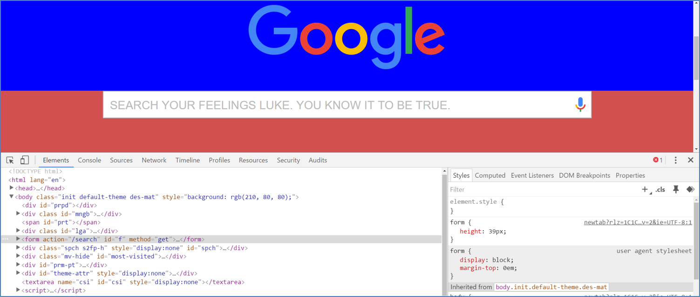

### 5. Students Do: Modify Websites (15 min)
* Then slack out the following activity:

* **Instructions:**
	
	* For the next 15 minutes, take a website that you commonly use (Amazon, Google, Huff Po, etc.) and heavily modify it using the Google Developer Tools.

	* Be sure to at least modify:

		* Content (Change words)
		* Colors
		* Spacing
		* Etc.

	* Send a screenshot to the class’ slack profile when you’re done.

* **Instructor/TAs:** 

	* Walk around during this time and ensure that students are making progress.

	* Remember students can still drop-out! Help them to enjoy fun activities like this.

	* Once the activity is complete showcase a few of the students' creations on the screen for everyone to see. 

### 6. Students Do: Modify Own Websites (10 mins) 
* Then slack out the following activity:

* **Instructions:**

	* For the next 10 minutes, take a website that you yourself worked on (ex: In-Class activities, homework assignments, etc.), and utilize the Google Developer Tools to help you test changes in real-time. 

	

	* Note: Focus on getting more comfortable using the Developer Tools. Trust us. You will WANT to use these Developer Tools as you proceed in this course. 

----------

### 7. BREAK (15 min) 

-----------

### 8. Instructor Do: CSS Resets (10 min)
* Take a few moments to explain that CSS can be loaded in multiple files, each of which is additive on the last. To assist you in this regard, see the examples in `1-MultipleCSS`. In each example, the CSS file is split between 1, 2, or 3 files. In each instance the end result is the same.

* Point out to students that the order matters, and that later CSS files will "overwrite" previous ones if there is a repeat. Feel encoraged to demonstrate this by modifying the examples in `1-MultipleCSS`.

* Have students first show by hands the browsers they use. 

* Then proceed to the series of slides on reset.css and browser differences. Point out that as of now, each browser determines for itself how things like headers, paragraphs, and tables should look. The font and thickness is all pre-set by the browser. This can create situations where your website will look one way in one browser and another way in another browser. 

* After pointing out that browsers work differently in how they render pages, emphasize that cross-browser compatibility is critical in web development. This is particularly important when you are creating an app with millions of users.

* Point out that you can incorporate a `reset.css` file, made available online, that ensures your site will look the very same in different browsers. (It resets any default styling that the browser adds.)

* Then demonstrate the use of a CSS reset. To do this:

	* Open the file `Example.html`

	* Then Google Search "CSS reset". The first link will be one found on the meyerweb website. [http://meyerweb.com/eric/tools/css/reset/](http://meyerweb.com/eric/tools/css/reset/).

	* Copy the CSS made available on that site and paste it into Sublime. Save that file somewhere locally on your computer.

	* Then link the CSS file into the HTML.

	* Run the HTML file again in browser and point out how it has been stripped of any pre-built browser styling, thereby allowing you to style everything from scratch.

	* 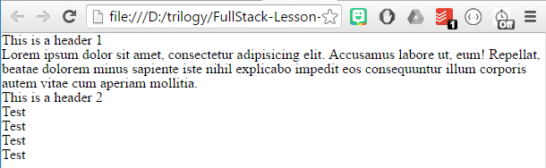

* Then point out that reset.css is important because of:

	* Cross Browser Compatibility

	* Ability to use pre-made CSS from someone else (an idea we will exploit repeatedly)

	* It's a common frontend question

### 9. Students Do: CSS Resets (10 min)

* Slack out the following instructions to students.

* **Instructions:**
	
	* Incorporate a CSS reset into any page you've worked on to date.

	* Hint: You should be using the CSS made available on this link: [http://meyerweb.com/eric/tools/css/reset/](http://meyerweb.com/eric/tools/css/reset/)

### 10. Instructor Do: Heroku Deployment (10 min)
* Spend a few moments explaining the concept of "deployment", namely the idea that as of yet, students' websites have only been accessible on their own computers. In order for their websites to be accessible by the public, it needs to be deployed on a server.

* Heroku provides a cloud application platform which we'll be using to deploy our websites. 

* Then have students login to their Heroku accounts online. Many of them will have forgotten their passwords, so give them a few moments to get situated.

### 11. Instructor Do: Heroku Demo (15 min)

* Then walk students through this process of deploying by deploying a site to Heroku yourself.

* Here is each and every step you'll need.

	* For Windows users open the program `cmd.exe`. Then type in `heroku login`. Provide your email address and password associated with Heroku. For Mac users, complete this step using Terminal. (This step is necessary, because Git Bash doesn't allow the `heroku login` step to work. However, once you've done this, you need not complete this step in future heroku work, unless you want to change users.)

	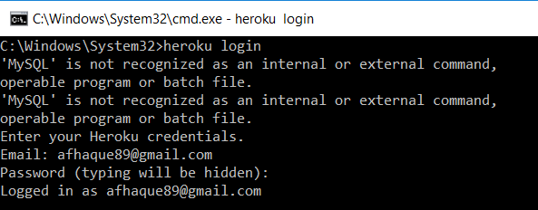

	* Create a repository in GitHub for your code. Clone this repository to your local machine.

	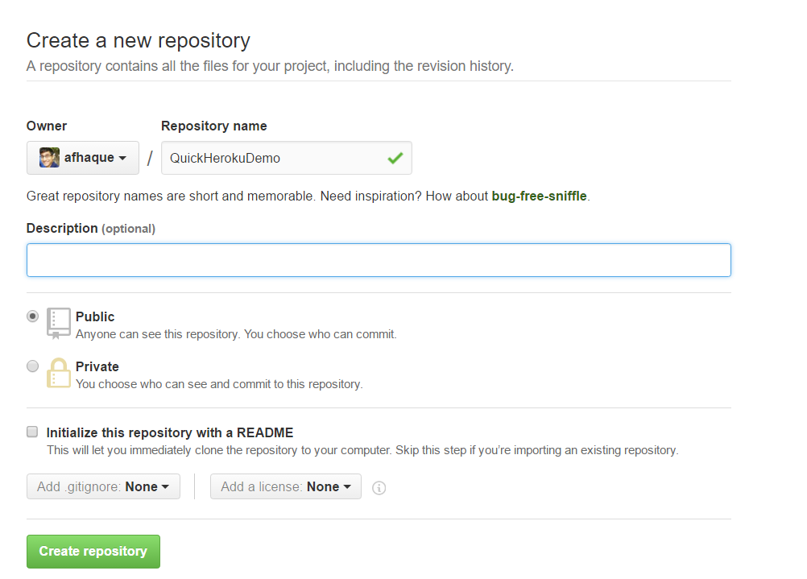

	* Copy the code found in the `PreDeploy` folder (`3-HerokuDeployedSite`).

	* Then, while inside the folder, create an `index.php` and `composer.json` file. 

	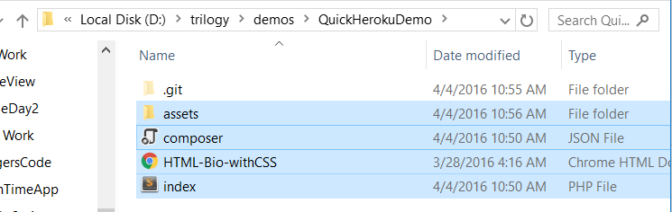

	* Inside the `index.php` file, write the following line of code: 

	```
	<?php include_once("HTML-Bio-withCSS.html"); ?>
	``` 

	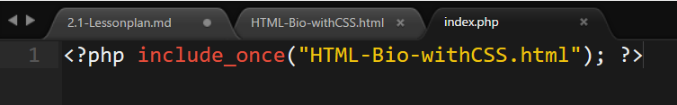

	Note: This file needs to be at the same level as your HTML file.

	* Inside the `composer.json`, write the following line of code: `{}`.

	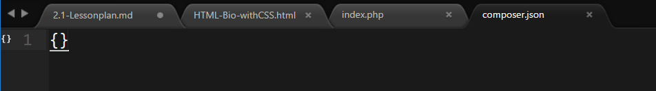

	* Now in bash/terminal, perform the following commands from this folder to push your changes to GitHub:

	```
	git add -A
	git commit -m "Added files to GitHub"
	git push origin master
	```

	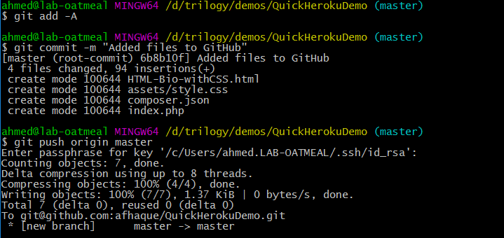

	* Demonstrate to students that the code now exists in GitHub.

	* Then run the following command in bash. `git remote -v`. Point out that this command listed out the places where git can send your code. Initially, it's just GitHub

	* Then run the command `heroku create`. This command will create an app on the Heroku website and also automatically add on a new remote path in git.

	* So now if you re-run the command `git remote -v`, you will see listed a new set of Heroku destinations.

	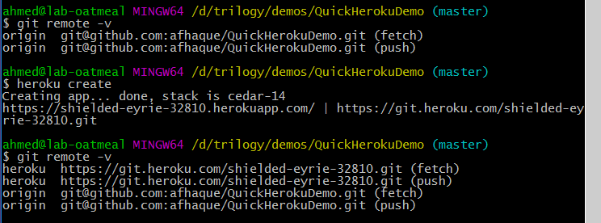

	* Then run the command `git push heroku master`. This will push your code to the Heroku hosting site.

	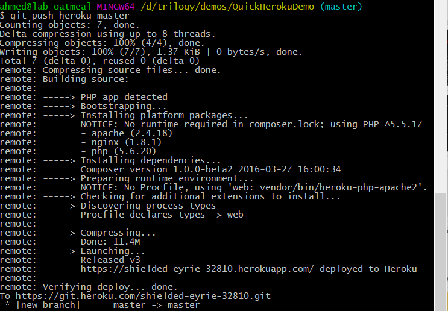

	* Finally, visit the heroku website. You should see listed your Heroku app's name. Click on the link and go to "Settings". There you will find the URL for your website. 

	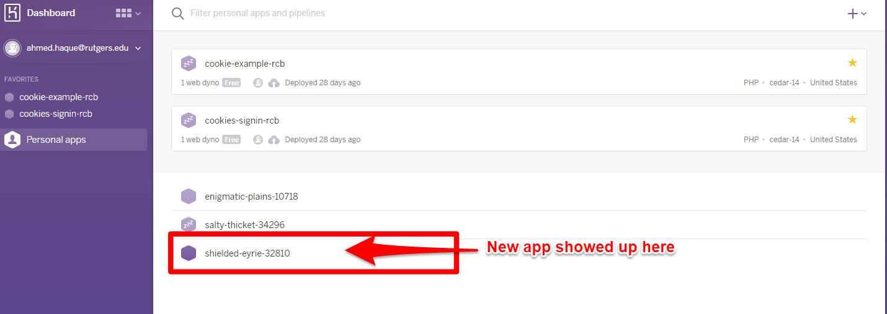

	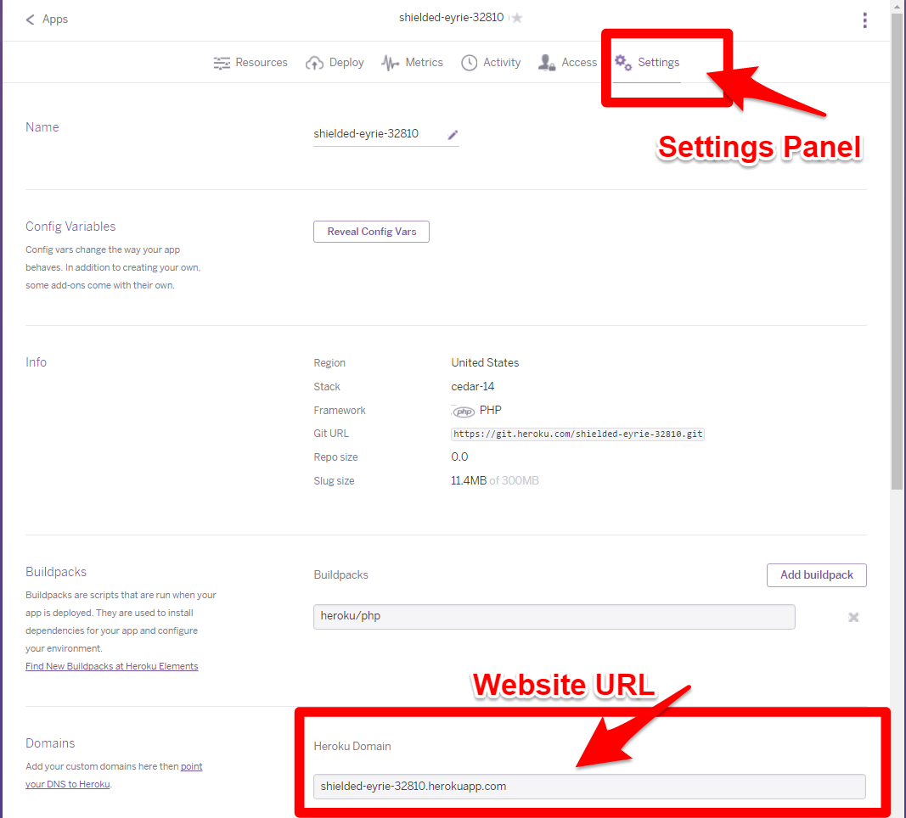

	* Copy and paste the URL of your website into the browser and show students that you have a working app.

	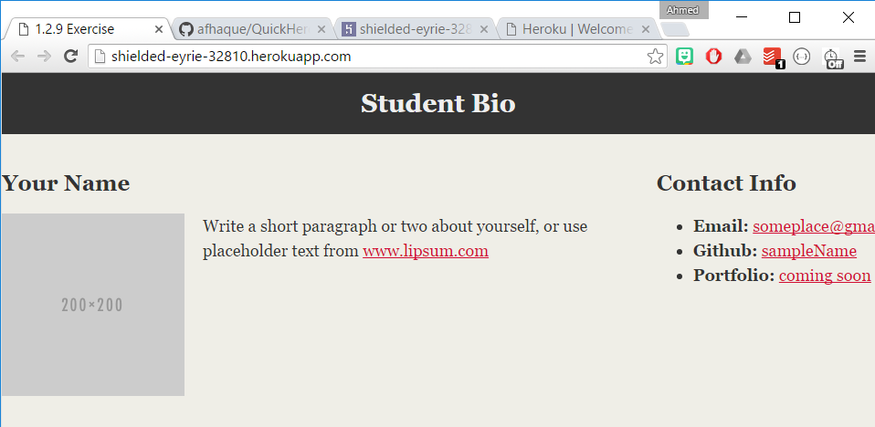

	* If any of this fails: Proceed to the student activity and see if students can figure it out. While they are working, read through the troubleshooting guide with TAs to see if you can identify the issue. 

### 11. Students Do: Heroku Deployment (30 min)

* Then immediately slack out the following file and instructions.

* **File:**

	* `Heroku Guide` (Supplemental)

* **Instructions:**
	
	* Using the Heroku Guide supplied to you, spend the next 30 minutes trying to deploy your application to Heroku. 

	* Reach out to instructors, TAs, and those around you as you need help.

	* If you finish early, reach out to a TA or instructor -- and they will assign you to students needing help. 

### 12. Instructor Do: Homework 1 Help (10 min)

* With the remainder of class, offer to help students looking to complete Homework 1. 

* If there is significant time remaining, unhide the slides on Git Pull Requests and go through those. 

-------

### Troubleshooting Guide:

* Below is a list of the most common issues that students present when trying to do Heroku deployments.

* **Index.php file or Composer.json is no where to be found:** The index.php file is like Heroku's map to your starting HTML file. Once it has that file all other references will work. Often students are completely missing the `index.php` or `composer.json` file. Often they have these files in completely different directories without realizing it. These files need to be in the same folder as their starting HTML file. These files also need to be at the highest level of the folder being pushed (i.e. you can't have `index.php` or `composer.json` in a sub-folder)

* **Index.php file path is pointing to the wrong file:** Often students, just copy and paste the filename you use in the index.php file. They need to make sure the filename matches their HTML filename.

* **Faulty Syntax on Index.php file:** Ensure that students have the correct syntax in the Index.php file. Copy and paste over their code to ensure that it is correct.

* **Forgetting to git "add -A, git commit -m":** Often students will completely skip the step where they save and commit their changes prior to pushing to GitHub. This will mean their webpage is essentially blank. As a starting point, ensure their code is present in GitHub before tinkering with Heroku issues. If they have no code in GitHub, they certainly have no code in Heroku

* **Images and/or css not appearing:** All filenames and paths are case senstive. Ensure that all links in HTML are using case-sensitive paths that match the folder directories casing.

* **Not using relative paths:** Many students are still using absolute paths to reference their CSS or image files. Help them to convert these to relative paths. 

* **Not knowing where their site deployed:** Show students that they need to login to the site and they will see the new app deployed on their menu. Then help them go to Settings and scroll until you see the "Heroku Domain".

* **Heroku Login not working on Windows:** For first time Windows Users, you need to use `cmd.exe` to login to Heroku. If you do not do this, bash will likely prevent you from logging in  and you will be unable to proceed with Heroku Steps.

* **More than five heroku apps:** As students progress in the course, they will have many more heroku apps. Once you get to five apps, Heroku requires users to authenticate their identity with a credit card. This credit card won't be charged, but its a requirement to have more than five active apps. 

* Beyond that... Good luck!

-------

### Copyright 
Coding Boot Camp (C) 2016. All Rights Reserved.
